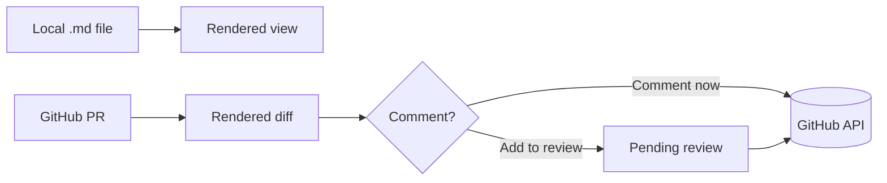

# PullMark demo document

This file exercises the GitHub-flavored Markdown features PullMark renders.

## Table

| Feature | Status |
|---|---|
| Tables | ✅ |
| Task lists | ✅ |
| Mermaid | ✅ |

## Task list

- [x] Render local files
- [x] Rendered PR diffs
- [ ] Editing (later)

## Code preview

```swift
struct MarkdownBlock: Equatable {
    let text: String
    let startLine: Int
    let endLine: Int
}
```

## Mermaid



## Alert

> [!NOTE]
> Alerts use GitHub's callout syntax.

> [!WARNING]
> This one is a warning.

~~Strikethrough~~ and a [link](https://github.com).

## Relative image


