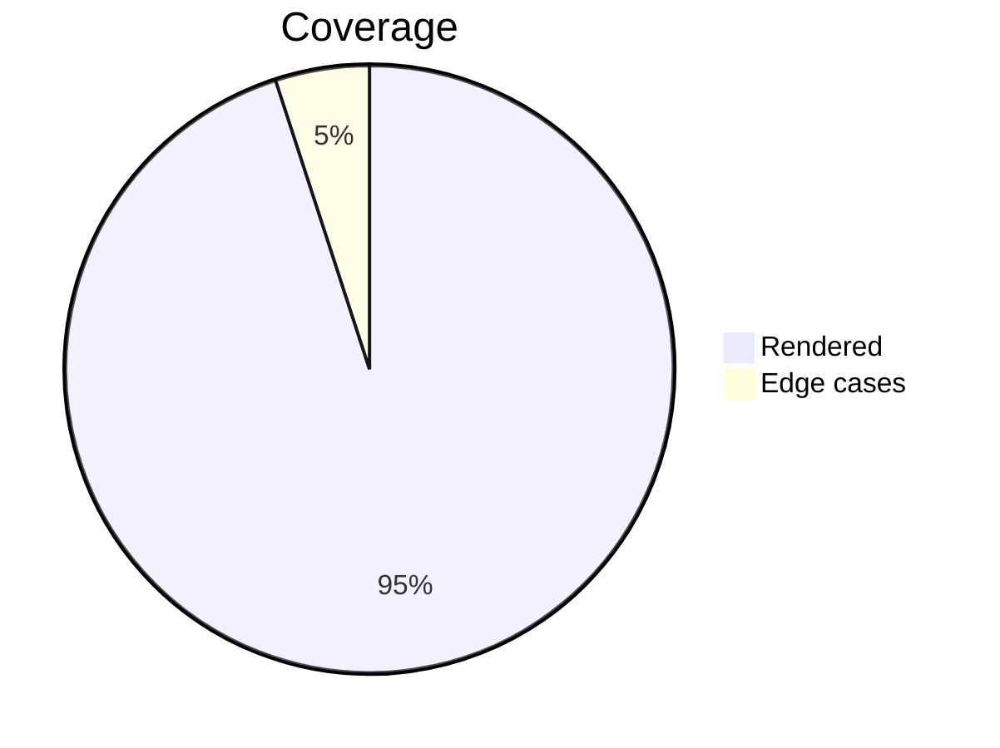

# GFM kitchen sink

Every construct PullMark should render. Used by `scripts/render-check.sh` as a regression test.

## Inline formatting

**Bold**, *italic*, ***bold italic***, ~~strikethrough~~, `inline code`,
a [link](https://example.com), an autolink https://example.com/auto,
and a footnote reference[^1].

[^1]: Footnotes render GitHub-style, collected at the bottom.

## Lists

1. First ordered item
2. Second ordered item
   1. Nested ordered
   2. Another nested
3. Third with **bold** inside

An interleaved paragraph, then a list starting at five:

5. Ordered list starting at five

- Unordered item
  - Nested unordered
    - Deeply nested
- Back to top level

- [x] Completed task
- [ ] Open task

## Blockquotes

> A blockquote with `code` and *emphasis*.
>
> > Nested blockquote.

## Table with alignment

| Left | Center | Right |
|:-----|:------:|------:|
| a    |   b    |     1 |
| c    |   d    |    22 |

## Code

```python
def greet(name: str) -> str:
    return f"Hello, {name}!"
```

## Horizontal rule

---

## Math

Inline math $E = mc^2$ sits in a sentence, but currency survives: it costs
$5 today and $10 tomorrow, and code keeps its dollars: `$x$`.

$$
\int_0^\infty e^{-x^2}\,dx = \frac{\sqrt{\pi}}{2}
$$

```text
$$ not math inside a fence $$
```

## Extended syntax

==Highlighted== text, water is H~2~O, and E = mc^2^ again as plain sup.
Also ~~strikethrough still works~~ next to a lone ~tilde~ subscript.

[toc]

## Mermaid



> [!TIP]
> Alerts render too.

Done.
